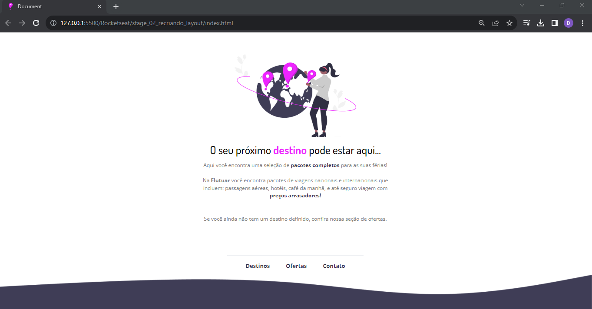

# Recriando layout | Explorer Stage 2

### Essa tarefa faz parte do curso Explorer da [Rocketseat](https://www.rocketseat.com.br).

Nessa atividade foi recriado o layout, com foco em: 

- Na estruturação do projeto com HTML; 
- Conceitos básicos em CSS;
- Posicionamento e alinhamento de elementos na tela;
- Aplicando fontes customizadas;
- Espaçamentos;
- Uso de favicon;

## 🔖 Layout 

Figma do projeto disponível nesse [Link](<https://www.figma.com/file/UIAuROHgjOncEeo1s7HJ0i/Projeto01-Extra-(Copy)?node-id=0%3A1&mode=dev>).